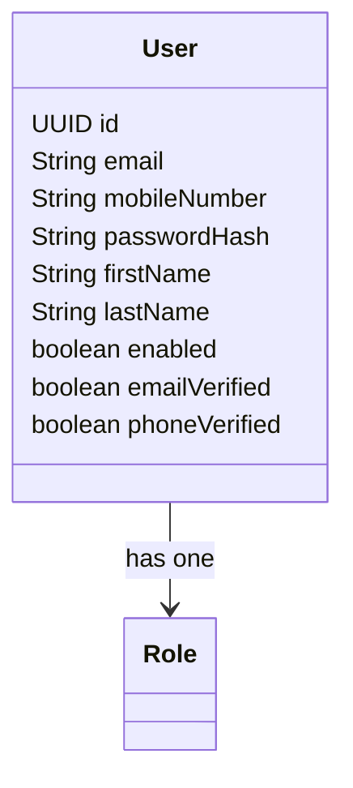

```mermaid
classDiagram
    class User {
        UUID id
        String email
        String mobileNumber
        String passwordHash
        String firstName
        String lastName
        boolean enabled
        boolean emailVerified
        boolean phoneVerified
    }

    class Role

    User --> Role : has one
```